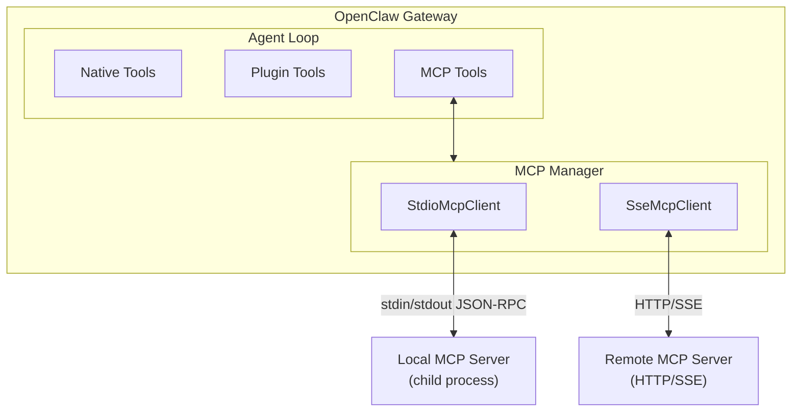
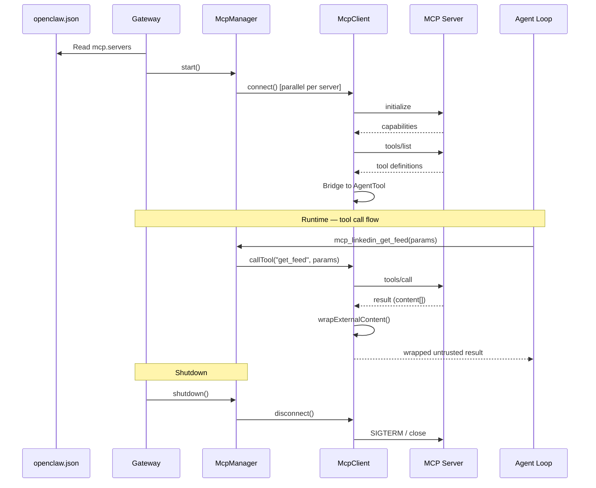
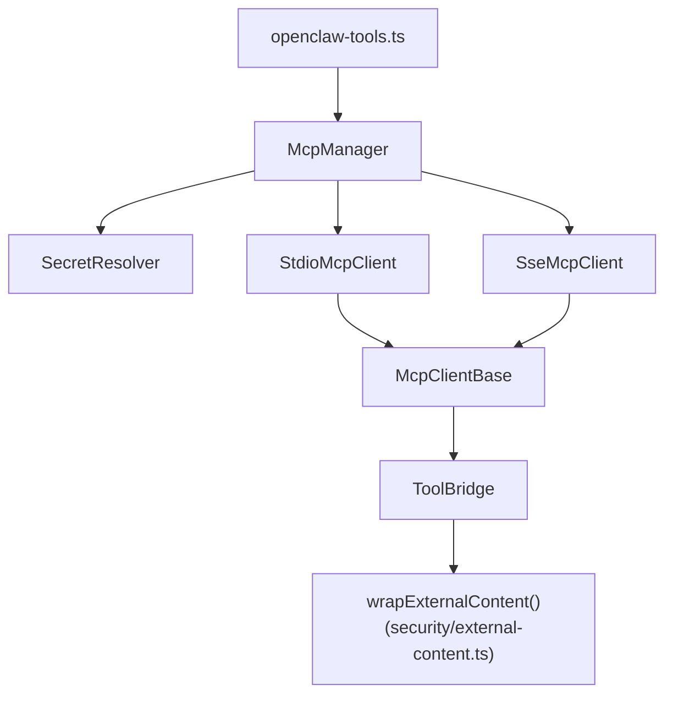
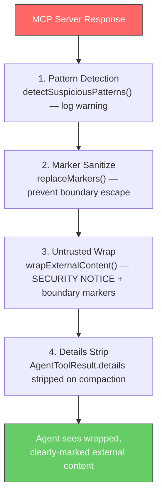
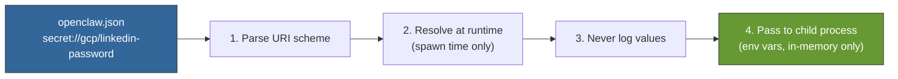

# OpenClaw Native MCP Support — Design Document

**Author:** Rye (amor71/openclaw fork)
**Date:** February 19, 2026
**Prerequisites:** [REQUIREMENTS.md](./REQUIREMENTS.md)
**Status:** DRAFT — Awaiting Review

---

## 1. Architecture Overview



### Data Flow



---

## 2. New Modules

### 2.1 Module Structure

```
src/mcp/
├── index.ts              # Public API: McpManager
├── manager.ts            # Lifecycle orchestrator for all MCP servers
├── client-stdio.ts       # stdio transport client (child process)
├── client-sse.ts         # SSE/HTTP transport client (remote)
├── client-base.ts        # Shared client interface and logic
├── tool-bridge.ts        # MCP tool schema → AgentTool adapter
├── secret-resolver.ts    # secret:// URI resolution
├── config.ts             # Config types and validation
└── __tests__/
    ├── manager.test.ts
    ├── client-stdio.test.ts
    ├── client-sse.test.ts
    ├── tool-bridge.test.ts
    ├── secret-resolver.test.ts
    └── mock-mcp-server.ts  # Test helper: minimal MCP server
```

### 2.2 Module Dependency Graph



---

## 3. Detailed Component Design

### 3.1 Config Types (`src/mcp/config.ts`)

```typescript
export type McpTransport = "stdio" | "sse" | "http";

export type McpServerConfig = {
  /** Enable/disable this server (default: true) */
  enabled?: boolean;

  /** Transport type (default: "stdio") */
  transport?: McpTransport;

  // --- stdio transport ---
  /** Executable command (required for stdio) */
  command?: string;
  /** Command arguments */
  args?: string[];
  /** Environment variables — supports secret:// URIs */
  env?: Record<string, string>;
  /** Working directory for the child process */
  cwd?: string;

  // --- SSE/HTTP transport ---
  /** Server URL (required for sse/http) */
  url?: string;
  /** HTTP headers — supports secret:// URIs */
  headers?: Record<string, string>;

  // --- Shared ---
  /** Connection timeout in ms (default: 30000) */
  timeout?: number;
  /** Tool call timeout in ms (default: 60000) */
  toolTimeout?: number;
  /** Auto-restart on crash — stdio only (default: true) */
  restartOnCrash?: boolean;
  /** Max restart attempts before giving up (default: 5) */
  maxRestarts?: number;
  /** Custom tool name prefix (default: server key name) */
  toolPrefix?: string;
};

export type McpConfig = {
  /** Named MCP server configurations */
  servers?: Record<string, McpServerConfig>;
};
```

**Config location in `openclaw.json`:**

```typescript
// In agents.defaults — applies to all agents
agents.defaults.mcp: McpConfig

// Per-agent override
agents.list[].mcp: McpConfig
```

This follows the existing pattern used by `agents.defaults.tools` / `agents.list[].tools`.

### 3.2 McpClientBase (`src/mcp/client-base.ts`)

Abstract base class for both transport types.

```typescript
import type { AnyAgentTool } from "../agents/tools/common.js";

export type McpClientStatus = "disconnected" | "connecting" | "ready" | "error" | "closed";

export type McpClientEvents = {
  statusChange: (status: McpClientStatus) => void;
  toolsChanged: () => void;
  error: (error: Error) => void;
};

export abstract class McpClientBase {
  readonly name: string;
  readonly config: McpServerConfig;
  protected status: McpClientStatus = "disconnected";
  protected mcpTools: McpToolInfo[] = [];

  constructor(name: string, config: McpServerConfig) { ... }

  /** Connect to MCP server and discover tools */
  abstract connect(): Promise<void>;

  /** Gracefully disconnect */
  abstract disconnect(): Promise<void>;

  /** Call a tool on this MCP server */
  abstract callTool(name: string, args: Record<string, unknown>): Promise<McpToolResult>;

  /** Get current status */
  getStatus(): McpClientStatus { return this.status; }

  /** Get bridged AgentTools for this server */
  getAgentTools(): AnyAgentTool[] {
    return this.mcpTools.map(tool => bridgeMcpTool(this, tool));
  }
}
```

### 3.3 StdioMcpClient (`src/mcp/client-stdio.ts`)

Manages a child process MCP server over stdin/stdout using JSON-RPC.

```typescript
import { Client } from "@modelcontextprotocol/sdk/client/index.js";
import { StdioClientTransport } from "@modelcontextprotocol/sdk/client/stdio.js";
import { spawn, type ChildProcess } from "node:child_process";

export class StdioMcpClient extends McpClientBase {
  private process: ChildProcess | null = null;
  private transport: StdioClientTransport | null = null;
  private client: Client | null = null;
  private restartCount = 0;
  private restartTimer: NodeJS.Timeout | null = null;

  async connect(): Promise<void> {
    this.status = "connecting";

    // 1. Resolve secret:// URIs in env vars
    const resolvedEnv = await resolveSecrets(this.config.env ?? {});

    // 2. Spawn child process via SDK transport
    this.transport = new StdioClientTransport({
      command: this.config.command!,
      args: this.config.args,
      env: { ...process.env, ...resolvedEnv },
      cwd: this.config.cwd,
    });

    // 3. Create MCP client and connect
    this.client = new Client(
      { name: "openclaw-mcp", version: "1.0.0" },
      { capabilities: {} }
    );
    await this.client.connect(this.transport);

    // 4. Discover tools
    const toolsResult = await this.client.listTools();
    this.mcpTools = toolsResult.tools;
    this.status = "ready";

    // 5. Monitor for crashes
    this.transport.onclose = () => this.handleDisconnect();
    this.transport.onerror = (err) => this.handleError(err);
  }

  async callTool(name: string, args: Record<string, unknown>): Promise<McpToolResult> {
    if (!this.client || this.status !== "ready") {
      throw new Error(`MCP server '${this.name}' is not ready (status: ${this.status})`);
    }
    const result = await this.client.callTool(
      { name, arguments: args },
      undefined,
      { timeout: this.config.toolTimeout ?? 60000 }
    );
    return result;
  }

  async disconnect(): Promise<void> {
    this.status = "closed";
    if (this.restartTimer) clearTimeout(this.restartTimer);
    await this.client?.close();
    this.transport = null;
    this.client = null;
  }

  private handleDisconnect(): void {
    if (this.status === "closed") return; // Intentional shutdown
    this.status = "error";
    if (this.config.restartOnCrash !== false && this.restartCount < (this.config.maxRestarts ?? 5)) {
      const delay = Math.min(1000 * Math.pow(2, this.restartCount), 30000);
      this.restartCount++;
      log.warn(`MCP server '${this.name}' crashed, restarting in ${delay}ms (attempt ${this.restartCount})`);
      this.restartTimer = setTimeout(() => this.connect(), delay);
    } else {
      log.error(`MCP server '${this.name}' crashed and max restarts exceeded`);
    }
  }
}
```

### 3.4 SseMcpClient (`src/mcp/client-sse.ts`)

Connects to a remote MCP server via SSE (Server-Sent Events) or streamable HTTP.

```typescript
import { Client } from "@modelcontextprotocol/sdk/client/index.js";
import { SSEClientTransport } from "@modelcontextprotocol/sdk/client/sse.js";
import { StreamableHTTPClientTransport } from "@modelcontextprotocol/sdk/client/streamableHttp.js";

export class SseMcpClient extends McpClientBase {
  private client: Client | null = null;
  private transport: SSEClientTransport | StreamableHTTPClientTransport | null = null;

  async connect(): Promise<void> {
    this.status = "connecting";

    // 1. Resolve secret:// URIs in headers
    const resolvedHeaders = await resolveSecrets(this.config.headers ?? {});

    // 2. Create transport based on config
    const url = new URL(this.config.url!);

    if (this.config.transport === "http") {
      this.transport = new StreamableHTTPClientTransport(url, {
        requestInit: { headers: resolvedHeaders },
      });
    } else {
      // Default SSE
      this.transport = new SSEClientTransport(url, {
        requestInit: { headers: resolvedHeaders },
      });
    }

    // 3. Create MCP client and connect
    this.client = new Client(
      { name: "openclaw-mcp", version: "1.0.0" },
      { capabilities: {} }
    );
    await this.client.connect(this.transport);

    // 4. Discover tools
    const toolsResult = await this.client.listTools();
    this.mcpTools = toolsResult.tools;
    this.status = "ready";

    // 5. Handle reconnection
    this.transport.onclose = () => this.handleDisconnect();
    this.transport.onerror = (err: Error) => this.handleError(err);
  }

  async callTool(name: string, args: Record<string, unknown>): Promise<McpToolResult> {
    if (!this.client || this.status !== "ready") {
      throw new Error(`MCP server '${this.name}' is not ready (status: ${this.status})`);
    }
    return await this.client.callTool(
      { name, arguments: args },
      undefined,
      { timeout: this.config.toolTimeout ?? 60000 }
    );
  }

  async disconnect(): Promise<void> {
    this.status = "closed";
    await this.client?.close();
    this.transport = null;
    this.client = null;
  }
}
```

### 3.5 ToolBridge (`src/mcp/tool-bridge.ts`)

Converts MCP tool definitions to OpenClaw `AgentTool` objects, including untrusted content wrapping.

```typescript
import { Type, type TSchema } from "@sinclair/typebox";
import type { AgentTool, AgentToolResult } from "@mariozechner/pi-agent-core";
import { wrapExternalContent, detectSuspiciousPatterns } from "../security/external-content.js";

/** Add "mcp_server" to ExternalContentSource union */
// Requires small addition to src/security/external-content.ts

/**
 * Convert MCP JSON Schema to TypeBox schema for OpenClaw tool parameters.
 */
export function convertMcpSchema(jsonSchema: Record<string, unknown>): TSchema {
  // MCP tools use standard JSON Schema for inputSchema.
  // TypeBox can consume JSON Schema via Type.Unsafe() for pass-through,
  // or we do a targeted conversion of common types.

  if (!jsonSchema || jsonSchema.type !== "object") {
    return Type.Object({});
  }

  const properties = (jsonSchema.properties ?? {}) as Record<string, any>;
  const required = new Set((jsonSchema.required ?? []) as string[]);
  const tbProperties: Record<string, TSchema> = {};

  for (const [key, prop] of Object.entries(properties)) {
    tbProperties[key] = convertPropertySchema(prop, required.has(key));
  }

  return Type.Object(tbProperties);
}

function convertPropertySchema(prop: any, isRequired: boolean): TSchema {
  const desc = prop.description;
  const base = (() => {
    switch (prop.type) {
      case "string":
        return prop.enum ? Type.Union(prop.enum.map((v: string) => Type.Literal(v))) : Type.String();
      case "number":
      case "integer":
        return Type.Number();
      case "boolean":
        return Type.Boolean();
      case "array":
        return Type.Array(prop.items ? convertPropertySchema(prop.items, true) : Type.Unknown());
      case "object":
        return Type.Record(Type.String(), Type.Unknown());
      default:
        return Type.Unknown();
    }
  })();

  const withDesc = desc ? { ...base, description: desc } : base;
  return isRequired ? withDesc : Type.Optional(withDesc);
}

/**
 * Bridge a single MCP tool into an OpenClaw AgentTool.
 */
export function bridgeMcpTool(
  client: McpClientBase,
  mcpTool: McpToolInfo,
  serverName: string,
  prefix?: string,
): AnyAgentTool {
  const toolPrefix = prefix ?? serverName;
  const toolName = `mcp_${toolPrefix}_${mcpTool.name}`;

  return {
    name: toolName,
    label: `MCP: ${serverName}/${mcpTool.name}`,
    description: `[MCP server: ${serverName}] ${mcpTool.description ?? "No description"}`,
    parameters: convertMcpSchema(mcpTool.inputSchema as Record<string, unknown>),

    execute: async (
      toolCallId: string,
      params: Record<string, unknown>,
    ): Promise<AgentToolResult<unknown>> => {
      try {
        const result = await client.callTool(mcpTool.name, params);

        // Convert MCP content array to text
        const textParts: string[] = [];
        const imageParts: Array<{ type: "image"; mimeType: string; data: string }> = [];

        for (const item of result.content ?? []) {
          if (item.type === "text") {
            textParts.push(item.text);
          } else if (item.type === "image") {
            imageParts.push(item);
          }
        }

        const rawText = textParts.join("\n");

        // SECURITY: Check for prompt injection patterns
        const suspicious = detectSuspiciousPatterns(rawText);
        if (suspicious.length > 0) {
          log.warn(
            `MCP server '${serverName}' tool '${mcpTool.name}' returned suspicious patterns: ${suspicious.join(", ")}`
          );
        }

        // SECURITY: Wrap as untrusted external content
        const wrappedText = wrapExternalContent(rawText, {
          source: "mcp_server",
          sender: serverName,
          includeWarning: true,
        });

        const content: Array<{ type: "text"; text: string }> = [
          { type: "text", text: wrappedText },
        ];

        return {
          content,
          details: {
            externalContent: {
              untrusted: true,
              source: "mcp_server",
              server: serverName,
              tool: mcpTool.name,
              wrapped: true,
            },
          },
        };
      } catch (error) {
        const message = error instanceof Error ? error.message : String(error);
        return {
          content: [{ type: "text", text: `MCP tool error (${serverName}/${mcpTool.name}): ${message}` }],
          details: { error: true },
        };
      }
    },
  };
}
```

### 3.6 SecretResolver (`src/mcp/secret-resolver.ts`)

Resolves `secret://` URIs at runtime.

```typescript
const SECRET_URI_REGEX = /^secret:\/\/(gcp|aws|vault|env)\/(.+)$/;

export type SecretProvider = "gcp" | "aws" | "vault" | "env";

/**
 * Resolve all secret:// URIs in an env/headers map.
 * Returns a new object with resolved plaintext values.
 */
export async function resolveSecrets(
  values: Record<string, string>,
): Promise<Record<string, string>> {
  const resolved: Record<string, string> = {};
  const resolutionPromises: Array<Promise<void>> = [];

  for (const [key, value] of Object.entries(values)) {
    const match = SECRET_URI_REGEX.exec(value);
    if (!match) {
      // Plaintext value — log warning
      if (looksLikeSecret(key)) {
        log.warn(
          `MCP config: '${key}' appears to be a credential stored in plaintext — consider using secret:// URI`
        );
      }
      resolved[key] = value;
      continue;
    }

    const provider = match[1] as SecretProvider;
    const secretPath = match[2];

    resolutionPromises.push(
      resolveSecret(provider, secretPath).then((secretValue) => {
        resolved[key] = secretValue;
      })
    );
  }

  await Promise.all(resolutionPromises);
  return resolved;
}

async function resolveSecret(provider: SecretProvider, path: string): Promise<string> {
  switch (provider) {
    case "gcp":
      return resolveGcpSecret(path);
    case "aws":
      return resolveAwsSecret(path);
    case "vault":
      return resolveVaultSecret(path);
    case "env":
      return resolveEnvSecret(path);
    default:
      throw new Error(`Unknown secret provider: ${provider}`);
  }
}

async function resolveGcpSecret(path: string): Promise<string> {
  // Parse: SECRET_NAME or SECRET_NAME#VERSION
  const [name, version = "latest"] = path.split("#");

  // Use @google-cloud/secret-manager if available,
  // or fall back to gcloud CLI
  try {
    const { SecretManagerServiceClient } = await import("@google-cloud/secret-manager");
    const client = new SecretManagerServiceClient();
    const projectId = await getGcpProjectId();
    const [response] = await client.accessSecretVersion({
      name: `projects/${projectId}/secrets/${name}/versions/${version}`,
    });
    const payload = response.payload?.data;
    if (!payload) throw new Error(`Empty secret: ${name}`);
    return typeof payload === "string" ? payload : Buffer.from(payload).toString("utf8");
  } catch {
    // Fallback: gcloud CLI
    const { execSync } = await import("node:child_process");
    const result = execSync(
      `gcloud secrets versions access ${version} --secret=${name} --format='get(payload.data)' | base64 -d`,
      { encoding: "utf8", timeout: 10000 }
    );
    return result.trim();
  }
}

async function resolveEnvSecret(name: string): Promise<string> {
  const value = process.env[name];
  if (!value) throw new Error(`Environment variable not found: ${name}`);
  return value;
}

// AWS and Vault: similar pattern, import SDK or CLI fallback
async function resolveAwsSecret(path: string): Promise<string> { /* ... */ }
async function resolveVaultSecret(path: string): Promise<string> { /* ... */ }

function looksLikeSecret(key: string): boolean {
  const lower = key.toLowerCase();
  return /password|secret|token|key|credential|auth/i.test(lower);
}
```

### 3.7 McpManager (`src/mcp/manager.ts`)

Top-level orchestrator that owns all MCP clients for an agent.

```typescript
export class McpManager {
  private clients = new Map<string, McpClientBase>();
  private started = false;

  constructor(private config: McpConfig) {}

  /**
   * Start all configured MCP servers (parallel).
   * Called during gateway startup.
   */
  async start(): Promise<void> {
    if (this.started) return;
    this.started = true;

    const servers = this.config.servers ?? {};
    const startPromises: Array<Promise<void>> = [];

    for (const [name, serverConfig] of Object.entries(servers)) {
      if (serverConfig.enabled === false) {
        log.info(`MCP server '${name}' is disabled, skipping`);
        continue;
      }

      const client = this.createClient(name, serverConfig);
      this.clients.set(name, client);

      startPromises.push(
        client.connect().catch((err) => {
          log.error(`MCP server '${name}' failed to start: ${err.message}`);
          // Don't throw — other servers should still start
        })
      );
    }

    await Promise.allSettled(startPromises);
    const readyCount = [...this.clients.values()].filter(c => c.getStatus() === "ready").length;
    log.info(`MCP manager started: ${readyCount}/${this.clients.size} servers ready`);
  }

  /**
   * Get all AgentTools from all ready MCP servers.
   */
  getAgentTools(): AnyAgentTool[] {
    const tools: AnyAgentTool[] = [];
    for (const client of this.clients.values()) {
      if (client.getStatus() === "ready") {
        tools.push(...client.getAgentTools());
      }
    }
    return tools;
  }

  /**
   * Shutdown all MCP servers cleanly.
   */
  async shutdown(): Promise<void> {
    const shutdownPromises = [...this.clients.values()].map(client =>
      client.disconnect().catch(err =>
        log.warn(`Error shutting down MCP server '${client.name}': ${err.message}`)
      )
    );
    await Promise.allSettled(shutdownPromises);
    this.clients.clear();
    this.started = false;
    log.info("MCP manager shut down");
  }

  /**
   * Get status of all servers (for diagnostics).
   */
  getStatus(): Record<string, { status: McpClientStatus; toolCount: number }> {
    const result: Record<string, any> = {};
    for (const [name, client] of this.clients) {
      result[name] = {
        status: client.getStatus(),
        toolCount: client.getAgentTools().length,
      };
    }
    return result;
  }

  private createClient(name: string, config: McpServerConfig): McpClientBase {
    const transport = config.transport ?? "stdio";
    switch (transport) {
      case "stdio":
        if (!config.command) throw new Error(`MCP server '${name}': stdio transport requires 'command'`);
        return new StdioMcpClient(name, config);
      case "sse":
      case "http":
        if (!config.url) throw new Error(`MCP server '${name}': ${transport} transport requires 'url'`);
        return new SseMcpClient(name, config);
      default:
        throw new Error(`MCP server '${name}': unknown transport '${transport}'`);
    }
  }
}
```

---

## 4. Integration Points

### 4.1 Config Schema (`src/config/`)

Add `McpConfig` to the agent config types:

```typescript
// src/config/types.agents.ts (or wherever agent config lives)
import type { McpConfig } from "../mcp/config.js";

export type AgentConfig = {
  // ... existing fields ...
  mcp?: McpConfig;
};

export type AgentDefaultsConfig = {
  // ... existing fields ...
  mcp?: McpConfig;
};
```

Add Zod/JSON Schema validation:

```typescript
// In the config validation layer
const McpServerSchema = z.object({
  enabled: z.boolean().optional(),
  transport: z.enum(["stdio", "sse", "http"]).optional(),
  command: z.string().optional(),
  args: z.array(z.string()).optional(),
  env: z.record(z.string()).optional(),
  cwd: z.string().optional(),
  url: z.string().url().optional(),
  headers: z.record(z.string()).optional(),
  timeout: z.number().positive().optional(),
  toolTimeout: z.number().positive().optional(),
  restartOnCrash: z.boolean().optional(),
  maxRestarts: z.number().nonnegative().optional(),
  toolPrefix: z.string().optional(),
}).refine(
  (data) => {
    const transport = data.transport ?? "stdio";
    if (transport === "stdio") return !!data.command;
    return !!data.url;
  },
  { message: "stdio requires 'command', sse/http requires 'url'" }
);

const McpConfigSchema = z.object({
  servers: z.record(McpServerSchema).optional(),
});
```

### 4.2 Tool Assembly (`src/agents/openclaw-tools.ts`)

Add MCP tools after plugin tools:

```typescript
import { McpManager } from "../mcp/manager.js";

export function createOpenClawTools(options?: {
  // ... existing options ...
  mcpManager?: McpManager;
}): AnyAgentTool[] {
  // ... existing tool creation ...

  const pluginTools = resolvePluginTools({ ... });

  // NEW: MCP tools
  const mcpTools = options?.mcpManager?.getAgentTools() ?? [];

  return [...tools, ...pluginTools, ...mcpTools];
}
```

### 4.3 ACP Translator (`src/acp/translator.ts`)

Remove the "ignoring" lines and pass MCP config through:

```typescript
// Before (lines ~124-125):
if (params.mcpServers.length > 0) {
  this.log(`ignoring ${params.mcpServers.length} MCP servers`);
}

// After:
if (params.mcpServers.length > 0) {
  this.log(`configuring ${params.mcpServers.length} MCP servers`);
  // Convert ACP mcpServers format to McpConfig and initialize
  await this.initializeMcpServers(params.mcpServers);
}
```

### 4.4 External Content Source (`src/security/external-content.ts`)

Add `"mcp_server"` to the `ExternalContentSource` type:

```typescript
export type ExternalContentSource =
  | "email"
  | "webhook"
  | "api"
  | "browser"
  | "channel_metadata"
  | "web_search"
  | "web_fetch"
  | "mcp_server"    // NEW
  | "unknown";

const EXTERNAL_SOURCE_LABELS: Record<ExternalContentSource, string> = {
  // ... existing ...
  mcp_server: "MCP Server",
};
```

### 4.5 Gateway Lifecycle

MCP manager must be started during gateway boot and stopped on shutdown:

```typescript
// In gateway startup sequence
const mcpManager = new McpManager(agentConfig.mcp ?? {});
await mcpManager.start();

// Pass to tool creation
const tools = createOpenClawTools({
  // ... existing ...
  mcpManager,
});

// In gateway shutdown
await mcpManager.shutdown();
```

### 4.6 Tool Policy Integration

MCP tools use prefixed names (`mcp_linkedin_get_feed`), so existing tool policy works naturally:

```json
{
  "gateway": {
    "tools": {
      "allow": ["mcp_linkedin_*"],
      "deny": ["mcp_filesystem_write_file"]
    }
  }
}
```

No changes needed to the tool policy engine — it already supports string matching on tool names.

---

## 5. Security Design

### 5.1 Prompt Injection Defense (Defense in Depth)



This is the **exact same pipeline** used for `web_fetch` results, which already handles untrusted web content. We're reusing proven infrastructure.

### 5.2 Credential Security



**Key properties:**
- Secret values only exist in memory — never written to disk, logs, or diagnostics
- `secret://` resolution happens lazily (at spawn time, not config load)
- Failed resolution = server doesn't start (fail-closed)
- Plaintext credentials in config trigger a warning log
- Integration with PR #16663 (GCP Secret Manager) — same underlying infrastructure

### 5.3 Process Isolation

- stdio MCP servers run as child processes with inherited (not elevated) permissions
- MCP servers have no access to OpenClaw internals — communication is strictly JSON-RPC over stdio
- A crashed MCP server cannot crash OpenClaw — all calls are in try/catch with timeouts

---

## 6. Error Handling Strategy

| Scenario | Behavior |
|----------|----------|
| MCP server won't start | Log error, mark as unavailable, other servers still start |
| MCP server crashes | Auto-restart with exponential backoff (1s → 30s max) |
| Max restarts exceeded | Log error, mark server as permanently failed |
| Tool call timeout | Return error to agent: "Tool call timed out after Xms" |
| Tool call returns error | Return error to agent: "MCP tool error: {message}" |
| Invalid tool response | Return error to agent with details |
| Secret resolution fails | Server doesn't start, clear error message (no secret value leaked) |
| Network error (SSE/HTTP) | Retry with backoff, same as crash recovery |

**Principle:** MCP failures produce tool-result errors, never exceptions. The agent gets a clear error message and can decide what to do.

---

## 7. Testing Strategy

### 7.1 Mock MCP Server

Build a minimal MCP server for testing:

```typescript
// src/mcp/__tests__/mock-mcp-server.ts
// A tiny MCP server that runs over stdio and exposes configurable tools
// Used by all tests — no external dependencies needed

export function createMockMcpServer(tools: MockToolDef[]): ChildProcess {
  // Spawns a node process that speaks MCP protocol
  // Responds to initialize, tools/list, tools/call
}
```

### 7.2 Test Matrix

| Test File | Coverage |
|-----------|----------|
| `manager.test.ts` | Start/stop lifecycle, parallel init, server failure isolation |
| `client-stdio.test.ts` | Connect, disconnect, tool call, crash recovery, restart backoff |
| `client-sse.test.ts` | Connect, disconnect, tool call, reconnection |
| `tool-bridge.test.ts` | Schema conversion, name prefixing, untrusted wrapping, error handling |
| `secret-resolver.test.ts` | URI parsing, GCP resolution, env fallback, error cases |
| `config.test.ts` | Schema validation, transport inference, required field checks |
| `integration.e2e.test.ts` | Full flow: config → start → tool call → result wrapping → shutdown |

---

## 8. Dependencies

| Package | Version | Purpose | Size |
|---------|---------|---------|------|
| `@modelcontextprotocol/sdk` | ^1.x | MCP client protocol implementation | ~50KB |
| `@google-cloud/secret-manager` | ^5.x | GCP secrets (optional, lazy import) | ~200KB |

**Note:** `@google-cloud/secret-manager` is already used by PR #16663. If that PR lands first, it's already a dependency. If not, we lazy-import it so it's optional.

No other new dependencies. TypeBox, child_process, and the security module are all existing.

---

## 9. Migration & Backwards Compatibility

- **No breaking changes** — MCP is purely additive
- Existing configs without `mcp` section work exactly as before
- The ACP translator change is backwards-compatible (empty mcpServers = no-op)
- Tool names are namespaced (`mcp_*`) so no collision with existing tools
- Feature can be completely disabled by omitting the `mcp` config section

---

## 10. Open Design Decisions

| # | Question | Recommendation | Status |
|---|----------|----------------|--------|
| 1 | Tool name format | `mcp_{server}_{tool}` — clear, greppable | Proposed |
| 2 | Lazy vs eager server start | Eager (parallel on boot) — simpler, avoids first-call latency | Proposed |
| 3 | MCP resource support | Defer to v2 — tools-only for v1 | Proposed |
| 4 | Tool re-discovery | On reconnect only — no polling for tool changes | Proposed |
| 5 | Config hot reload | Defer to v2 — requires gateway restart for MCP changes | Proposed |
