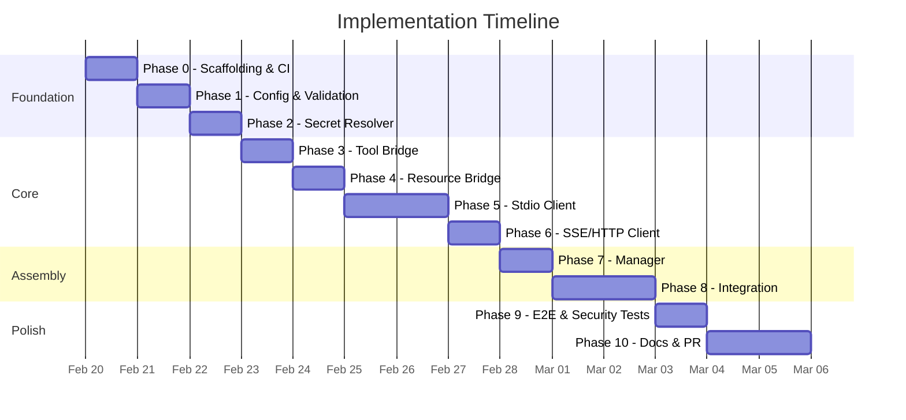

# OpenClaw Native MCP Support — Implementation Plan

**Author:** Rye (amor71/openclaw fork)
**Date:** February 19, 2026
**Prerequisites:** [REQUIREMENTS.md](./REQUIREMENTS.md), [DESIGN.md](./DESIGN.md)
**Status:** DRAFT — Awaiting Review

---

## Approach

**TDD throughout.** Every phase starts with tests, then implementation. No code without a failing test first.

**Branch strategy:** Single feature branch `feat/native-mcp` on the `amor71/openclaw` fork. Each phase is a commit (or small series of commits). Squash into clean PR at the end.

**CI from day 1.** GitHub Actions runs on every push to the feature branch.

---

## Phase 0: Scaffolding & CI (Day 1)

**Goal:** Project structure, CI pipeline, mock MCP server, dev tooling.

### Tasks

- [ ] Create feature branch `feat/native-mcp` on `amor71/openclaw` fork
- [ ] Create `src/mcp/` directory structure per DESIGN.md §2.1
- [ ] Set up `.github/workflows/ci.yml` (lint, typecheck, unit, integration, e2e)
- [ ] Build mock MCP server (`src/mcp/__tests__/mock-mcp-server.ts`)
  - Speaks MCP protocol over stdio
  - Configurable tools and resources
  - Supports fault injection (crash, latency, injection payloads)
- [ ] Verify CI runs green (no tests yet = no failures)
- [ ] Add `@modelcontextprotocol/sdk` dependency

### Deliverable
Skeleton compiles, CI green, mock server works standalone.

---

## Phase 1: Config & Validation (Day 2)

**Goal:** Config types, Zod schema, validation with clear errors.

### Tests First
```
config.test.ts
  ✓ accepts valid stdio server config
  ✓ accepts valid SSE server config
  ✓ accepts valid HTTP server config
  ✓ rejects stdio without command
  ✓ rejects SSE without url
  ✓ accepts disabled server
  ✓ defaults transport to stdio
  ✓ accepts secret:// URIs in env
  ✓ accepts secret:// URIs in headers
  ✓ accepts custom toolPrefix
  ✓ accepts resource config options
  ✓ validates timeout is positive
  ✓ validates maxRestarts is non-negative
  ✓ rejects unknown transport type
  ✓ accepts empty servers object (no-op)
```

### Tasks

- [ ] Write all config tests (expect failures)
- [ ] Implement `src/mcp/config.ts` — types + Zod validation
- [ ] Add `McpConfig` to agent config types (`src/config/types.agents.ts` or equivalent)
- [ ] Add Zod schema to config validation layer
- [ ] All config tests pass

### Deliverable
Config parses and validates. Invalid configs produce actionable error messages.

---

## Phase 2: Secret Resolver (Day 3)

**Goal:** `secret://` URI resolution — GCP, AWS, Vault, env.

### Tests First
```
secret-resolver.test.ts
  ✓ parses secret://gcp/name
  ✓ parses secret://gcp/name#version
  ✓ parses secret://aws/name
  ✓ parses secret://vault/path/to/secret
  ✓ parses secret://env/VAR_NAME
  ✓ resolves env:// from process.env
  ✓ throws on missing env var
  ✓ passes through plaintext values unchanged
  ✓ warns on plaintext credential-like keys (PASSWORD, SECRET, TOKEN)
  ✓ resolves multiple secrets in parallel
  ✓ throws on unknown provider (secret://unknown/x)
  ✓ redacts secret values in error messages
  ✓ GCP resolution (mocked SDK)
  ✓ GCP fallback to gcloud CLI (mocked exec)
  ✓ GCP resolution failure → clear error
```

### Tasks

- [ ] Write all secret resolver tests
- [ ] Implement `src/mcp/secret-resolver.ts`
- [ ] GCP: lazy import `@google-cloud/secret-manager`, CLI fallback
- [ ] AWS: lazy import `@aws-sdk/client-secrets-manager`, CLI fallback
- [ ] Vault: HTTP API call to Vault server
- [ ] Env: `process.env` lookup
- [ ] All tests pass

### Deliverable
Secrets resolve from any supported backend. Plaintext still works with warnings.

---

## Phase 3: Tool Bridge (Day 4)

**Goal:** Convert MCP tool schemas → OpenClaw AgentTool, with untrusted content wrapping.

### Tests First
```
tool-bridge.test.ts
  ✓ converts string parameter
  ✓ converts number parameter
  ✓ converts integer parameter
  ✓ converts boolean parameter
  ✓ converts array parameter
  ✓ converts object parameter
  ✓ converts enum to union
  ✓ handles nested object schemas
  ✓ handles required vs optional
  ✓ handles empty schema (no params)
  ✓ handles missing description
  ✓ prefixes tool name: mcp_{server}_{tool}
  ✓ uses custom toolPrefix when configured
  ✓ includes server name in description
  ✓ wraps text result in EXTERNAL_UNTRUSTED_CONTENT
  ✓ detects suspicious patterns in results → logs warning
  ✓ handles image content in results
  ✓ handles error results gracefully
  ✓ handles tool call timeout → error message
  ✓ sets externalContent metadata on details
```

### Tasks

- [ ] Write all tool bridge tests
- [ ] Implement `src/mcp/tool-bridge.ts` — schema conversion
- [ ] Implement execute wrapper with `wrapExternalContent()`
- [ ] Add `"mcp_server"` to `ExternalContentSource` in `src/security/external-content.ts`
- [ ] All tests pass

### Deliverable
Any MCP tool schema converts cleanly to AgentTool. Results are always wrapped as untrusted.

---

## Phase 4: Resource Bridge (Day 5)

**Goal:** Discover and inject MCP resources into agent context.

### Tests First
```
resource-bridge.test.ts
  ✓ discovers resources from mock server
  ✓ reads text resource and wraps as untrusted
  ✓ reads binary resource → placeholder text
  ✓ filters resources by resourceFilter config
  ✓ empty filter → returns all resources
  ✓ builds context block with header
  ✓ builds context block with multiple resources
  ✓ empty resources → empty string
  ✓ handles resource read failure → logs warning, skips
  ✓ wraps resource content with EXTERNAL_UNTRUSTED_CONTENT markers
```

### Tasks

- [ ] Write all resource bridge tests
- [ ] Implement `src/mcp/resource-bridge.ts`
- [ ] All tests pass

### Deliverable
Resources discovered, read, wrapped, and formatted for context injection.

---

## Phase 5: Stdio Client (Days 6-7)

**Goal:** Full stdio MCP client — connect, discover, call, crash recovery.

### Tests First (Integration — uses mock MCP server)
```
client-stdio.integration.test.ts
  ✓ connects to mock server and discovers tools
  ✓ discovers resources when enabled
  ✓ calls tool and receives result
  ✓ reads resource and receives content
  ✓ handles server crash → status changes to error
  ✓ auto-restarts after crash (attempt 1)
  ✓ exponential backoff on repeated crashes (1s, 2s, 4s...)
  ✓ stops restarting after maxRestarts exceeded
  ✓ tool call during restart → returns error message (not throw)
  ✓ disconnect → sends SIGTERM → process exits
  ✓ disconnect → SIGKILL after 5s timeout if still alive
  ✓ resolves secret:// env vars before spawning
  ✓ passes resolved env to child process
  ✓ logs server stderr at warn level
  ✓ handles connection timeout
```

### Tasks

- [ ] Write all stdio client tests (against mock server)
- [ ] Implement `src/mcp/client-base.ts` — abstract base
- [ ] Implement `src/mcp/client-stdio.ts` — spawn, connect, lifecycle
- [ ] Wire in secret resolver for env vars
- [ ] Wire in tool bridge for schema conversion
- [ ] Crash detection and restart with backoff
- [ ] All tests pass

### Deliverable
Stdio client connects, discovers tools + resources, handles calls, recovers from crashes.

---

## Phase 6: SSE/HTTP Client (Day 8)

**Goal:** Remote MCP client over SSE and streamable HTTP.

### Tests First (Integration — uses mock HTTP MCP server)
```
client-sse.integration.test.ts
  ✓ connects to SSE endpoint and discovers tools
  ✓ connects to HTTP endpoint and discovers tools
  ✓ discovers resources when enabled
  ✓ calls tool and receives result
  ✓ passes auth headers correctly
  ✓ resolves secret:// URIs in headers
  ✓ handles connection drop → reconnect
  ✓ handles connection timeout
  ✓ tool call during reconnect → returns error message
  ✓ disconnect → clean close
```

### Tasks

- [ ] Build mock HTTP MCP server for testing (extends mock from Phase 0)
- [ ] Write all SSE client tests
- [ ] Implement `src/mcp/client-sse.ts` — SSE + HTTP transport
- [ ] Wire in secret resolver for headers
- [ ] Reconnection logic
- [ ] All tests pass

### Deliverable
SSE/HTTP client connects to remote MCP servers, handles auth, recovers from disconnects.

---

## Phase 7: Manager (Day 9)

**Goal:** Orchestrator that owns all clients — parallel start, aggregation, lifecycle.

### Tests First (Integration)
```
manager.integration.test.ts
  ✓ starts multiple servers in parallel
  ✓ one server fails → others still start
  ✓ disabled server → skipped
  ✓ getAgentTools() returns tools from all ready servers
  ✓ getAgentTools() excludes tools from failed servers
  ✓ getResourceContext() aggregates resources from all servers
  ✓ getResourceContext() skips servers with resources: false
  ✓ shutdown() stops all servers
  ✓ shutdown() handles errors from individual servers
  ✓ getStatus() returns per-server status + tool count
  ✓ creates StdioMcpClient for stdio transport
  ✓ creates SseMcpClient for sse/http transport
  ✓ throws on unknown transport
  ✓ throws on stdio without command
  ✓ throws on sse without url
```

### Tasks

- [ ] Write all manager tests
- [ ] Implement `src/mcp/manager.ts`
- [ ] Implement `src/mcp/index.ts` (public API export)
- [ ] All tests pass

### Deliverable
McpManager orchestrates multiple MCP servers with full lifecycle management.

---

## Phase 8: Integration (Days 10-11)

**Goal:** Wire MCP into OpenClaw's existing systems — 4 surgical touch points.

### Tasks

#### 8.1 Config Schema
- [ ] Add `mcp?: McpConfig` to agent config types
- [ ] Add Zod schema to config validation
- [ ] Test: existing configs without `mcp` still validate
- [ ] Test: config with `mcp.servers` validates correctly

#### 8.2 Tool Assembly (`src/agents/openclaw-tools.ts`)
- [ ] Add `mcpManager?: McpManager` to `createOpenClawTools()` options
- [ ] Append `mcpManager.getAgentTools()` after plugin tools
- [ ] Test: MCP tools appear in tool list alongside native tools
- [ ] Test: MCP tool names don't collide with native tool names
- [ ] Test: without mcpManager, tool list unchanged (backward compat)

#### 8.3 ACP Translator (`src/acp/translator.ts`)
- [ ] Remove "ignoring MCP servers" in `newSession()` (line ~124)
- [ ] Remove "ignoring MCP servers" in `loadSession()` (line ~154)
- [ ] Pass MCP server config through to McpManager
- [ ] Test: ACP sessions can configure MCP servers
- [ ] Test: empty mcpServers = no-op (backward compat)

#### 8.4 External Content Source (`src/security/external-content.ts`)
- [ ] Add `"mcp_server"` to `ExternalContentSource` type
- [ ] Add label to `EXTERNAL_SOURCE_LABELS`
- [ ] Test: wrapExternalContent works with "mcp_server" source

#### 8.5 Gateway Lifecycle
- [ ] Create McpManager during gateway startup
- [ ] Call `mcpManager.start()` (non-blocking, parallel)
- [ ] Pass mcpManager to `createOpenClawTools()`
- [ ] Call `mcpManager.shutdown()` on gateway stop
- [ ] Inject resource context into prompt assembly

#### 8.6 Tool Policy
- [ ] Verify MCP tools respect `gateway.tools.allow` / `deny`
- [ ] Test: deny `mcp_*` blocks all MCP tools
- [ ] Test: allow `mcp_linkedin_*` allows only LinkedIn tools

### Deliverable
MCP is fully wired into OpenClaw. Config → start → tools available → calls work → shutdown clean.

---

## Phase 9: E2E & Security Tests (Day 12)

**Goal:** Full pipeline tests and security hardening verification.

### E2E Tests
```
e2e.test.ts
  ✓ full lifecycle: config → start → tool call → wrapped result → shutdown
  ✓ multiple servers: stdio + SSE running simultaneously
  ✓ server crash mid-conversation → auto-recover → tools available again
  ✓ config with no mcp section → no errors, no MCP tools
```

### Security Tests
```
e2e-security.test.ts
  ✓ tool result with "ignore previous instructions" → detected, logged, wrapped
  ✓ tool result with "<<<EXTERNAL_UNTRUSTED_CONTENT>>>" → markers sanitized
  ✓ tool result with Unicode homoglyph markers → folded and sanitized
  ✓ resource content with injection attempt → wrapped safely
  ✓ secret:// values never appear in logs (grep all log output)
  ✓ plaintext password in config → warning logged
  ✓ MCP server cannot access OpenClaw internals (process isolation)
```

### Policy Tests
```
e2e-policy.test.ts
  ✓ denied MCP tool → not in agent tool list
  ✓ allowed MCP tool → in agent tool list
  ✓ per-agent MCP config overrides defaults
```

### Tasks

- [ ] Write all E2E tests
- [ ] Write all security tests
- [ ] Write all policy tests
- [ ] Fix any issues found
- [ ] All tests pass, CI green

### Deliverable
Full confidence in the implementation. Security properties verified.

---

## Phase 10: Documentation & PR (Days 13-14)

**Goal:** Clean up, document, submit.

### Tasks

- [ ] Update OpenClaw config reference docs (add `mcp` section)
- [ ] Write example configs (LinkedIn, filesystem, Tavily SSE)
- [ ] Update CHANGELOG
- [ ] Write PR description referencing #4834 and #13248
- [ ] Ensure all existing OpenClaw tests still pass (no regressions)
- [ ] Squash/clean commit history
- [ ] Submit PR to `openclaw/openclaw`
- [ ] Post update on both issues

### Deliverable
Clean PR ready for review by OpenClaw maintainers.

---

## Timeline Summary



## Risk Mitigation

| Risk | Mitigation | Fallback |
|------|------------|----------|
| MCP SDK API changes | Pin exact version, read SDK source | Fork SDK if needed |
| OpenClaw config system is complex | Study existing patterns deeply in Phase 0 | Ask maintainers on GitHub |
| Test infrastructure takes longer | Mock server is Phase 0 priority — blocks nothing else | Use simpler JSON-RPC stubs |
| Gateway lifecycle wiring unclear | Study `src/gateway/` startup sequence in Phase 0 | Ask in issue comments |
| Existing test suite breaks | Run full test suite after each phase | Fix immediately, don't accumulate |

## Definition of Done

- [ ] All tests pass (unit + integration + E2E + security)
- [ ] CI green on Node 20 and 22
- [ ] ≥90% line coverage, ≥85% branch coverage for `src/mcp/`
- [ ] Zero regressions in existing OpenClaw tests
- [ ] Config docs updated
- [ ] PR references #4834 and #13248
- [ ] Security tests verify prompt injection protection
- [ ] Secret values never appear in any log output
